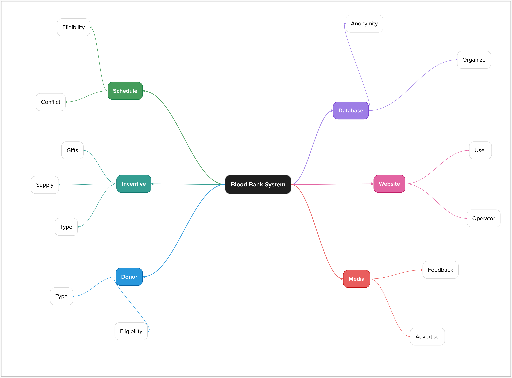

# System Design
================

**Background**
------------

I recently donated blood with WeAreBlood in Austin, and was inspired to try and design a system for the blood donation process.

**System Requirements**
----------------------

* Create a user-friendly interface for donors to register and schedule appointments
* Develop a database to store donor information and track donation history
* Implement a machine learning algorithm to analyze donor behavior and provide personalized recommendations and incentives
* Design a system to track and analyze blood donation data to identify trends and patterns
* Provide real-time updates on blood availability and demand

**System Components**
--------------------

* **Frontend**: User interface for donors to register and schedule appointments
* **Backend**: Database and machine learning algorithm to analyze donor behavior and provide personalized recommendations
* **Database**: Storage for donor information and donation history
* **Machine Learning Algorithm**: Analyzes donor behavior and provides personalized recommendations
* **Real-time Updates**: Provides updates on blood availability and demand

**System Architecture**
----------------------

* **Layered Architecture**: Frontend, Backend, and Database layers
* **Service-Oriented Architecture**: Each layer provides a specific service to the system
* **Microservices Architecture**: Each layer is a separate microservice that communicates with other microservices

**System Testing**
-----------------

* **Unit Testing**: Test individual components of the system
* **Integration Testing**: Test the system as a whole
* **System Testing**: Test the system in a real-world environment

**System Deployment**
--------------------

* **Cloud Deployment**: Deploy the system on a cloud platform
* **On-Premises Deployment**: Deploy the system on a local server
* **Hybrid Deployment**: Deploy the system on a combination of cloud and on-prem

**Graphical Diagram**
--------------------

Here is my mockup of what the system could be comprised of generated using an online tool callled mural.

